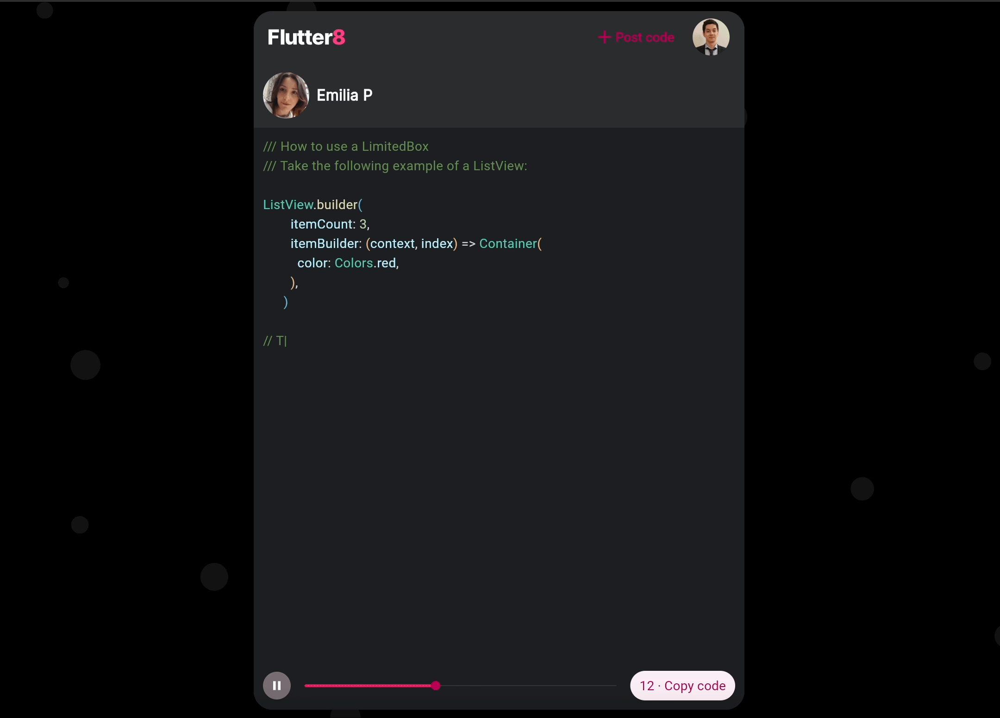

# Flutter8

[](https://github.com/adrian-antoci/flutter8/actions/workflows/firebase-deploy-main.yml)

Flutter8 is an open-source platform aimed at learning Flutter in small chunks of code.


## Try it

[Flutter8.com](https:/flutter8.com) - Deployed as a web app.

## Getting started

Flutter8 requires a Firebase account with Firestore DB enabled.

Step 1: Clone this repo

```sh
git clone https://github.com/adrian-antoci/flutter8.git
```

Step 2: Open a new terminal and navigate to the project folder and run:

```sh
flutter pub get
```

Step 3: Go to Firebase, create a new Web App, enable Google SignIn.

Step 4: Edit the default.env file and paste values from Firebase

Step 5: Run the project!

```sh
flutter run
```

## License

MIT

